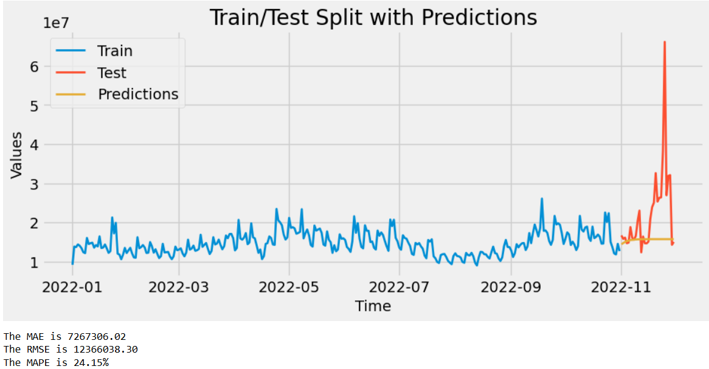
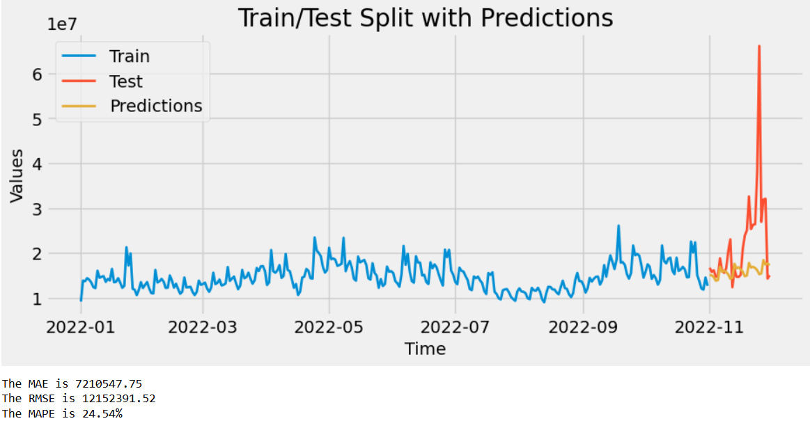
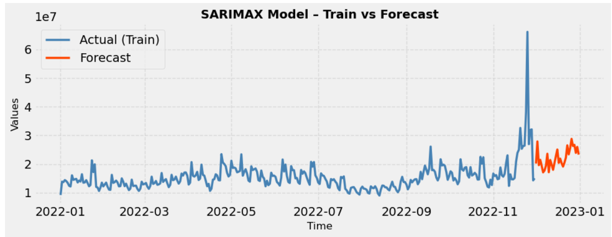
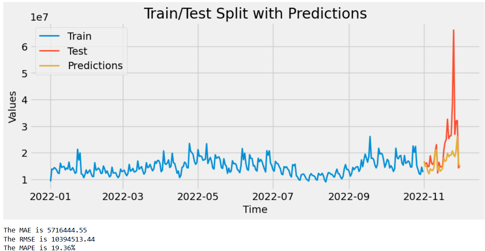
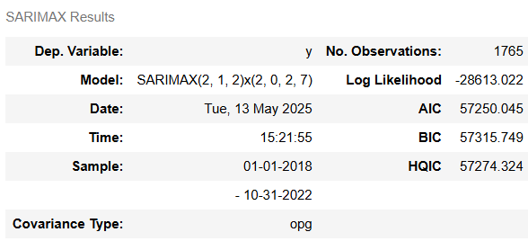
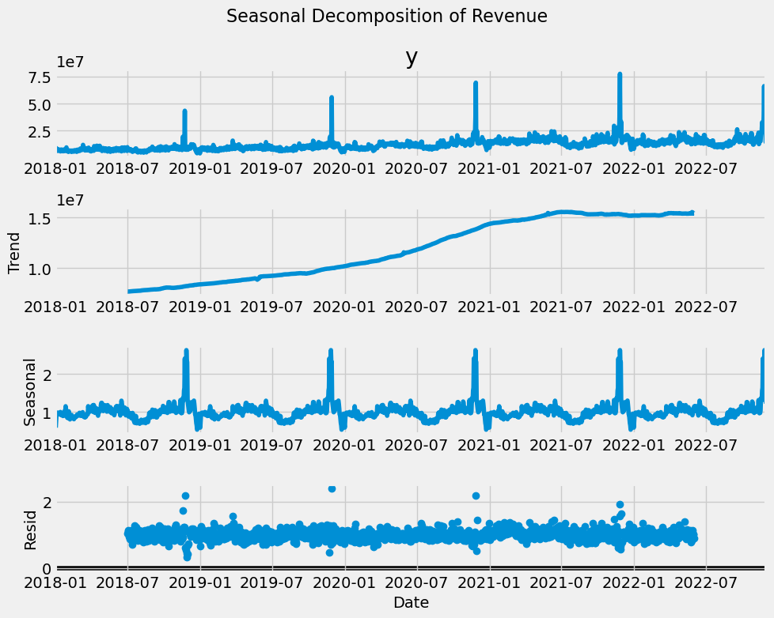
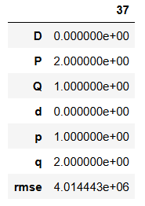
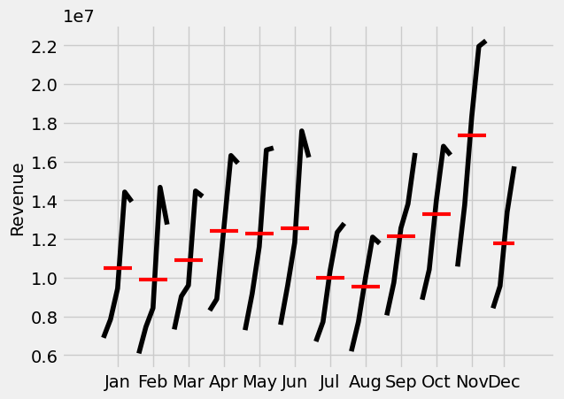
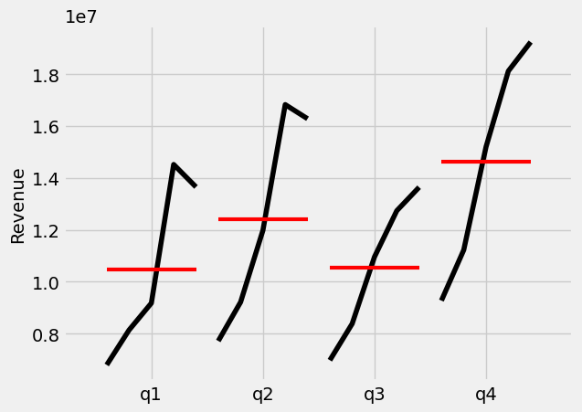

# 🍫 Daily Revenue Forecasting for a ChocoBar Company (Time Series)

This project focuses on forecasting the daily revenue of a ChocoBar company using **ARIMA**, **SARIMA**, and **SARIMAX** models in Python. The objective is to identify the best-performing model for short-term forecasting by incorporating both temporal and promotional factors.

---

## 📁 Dataset Description

**Source**: Internal company data (simulated)

The dataset contains daily records of revenue and associated promotional strategies.

### Columns:
- `date`: Date of transaction (daily frequency)
- `revenue`: Total daily revenue (in currency)
- `discount_rate`: Percentage discount offered on that day
- `coupon_rate`: Percentage of revenue affected by coupon use

This data is well-suited for **time series forecasting with exogenous variables**, particularly useful in retail and marketing analytics.

---

## 🔧 Tools & Libraries Used

- Python (Jupyter Notebook)
- `pandas`, `numpy` for data manipulation
- `statsmodels` for ARIMA/SARIMA/SARIMAX modeling
- `matplotlib`, `seaborn` for visualization
- `scikit-learn` for performance evaluation (MAE, RMSE, MAPE)

---

## 📊 Models Applied

- **ARIMA**: Autoregressive Integrated Moving Average  
- **SARIMA**: Seasonal ARIMA (captures weekly/monthly seasonality)  
- **SARIMAX**: SARIMA + Exogenous variables (`discount_rate`, `coupon_rate`)

---

## ✅ Best Performing Model: SARIMAX

SARIMAX outperformed both ARIMA and SARIMA by integrating promotional variables. This led to:

- 🔻 Lower **MAE**, **RMSE**, and **MAPE**
- 📈 Better handling of revenue spikes due to promotions
- 🔁 Greater adaptability to campaign-driven trends

---

# 📊 Forecasting Insights – Daily Revenue Prediction

This project explored three time series forecasting models (ARIMA, SARIMA, SARIMAX) to predict daily revenue for a ChocoBar company.

---

## 🔍 Key Findings

- Revenue is influenced not just by time trends and seasonality, but also by **discounts and coupon usage**.
- **ARIMA** performed poorly due to lack of seasonality modeling.

- **SARIMA** improved results by modeling weekly/monthly seasonal patterns.

- **SARIMAX** delivered the best accuracy by incorporating external variables (exogenous regressors):

---

## 📈 SARIMAX Benefits

- Captures promotion-driven revenue fluctuations.
- Evaluation metrics for SARIMAX model:

- **MAE**: 5.7M  
- **RMSE**: 10.4M  
- **MAPE**: 19.36%  
- Lower than ARIMA/SARIMA errors (MAPE ~24%)

---

## 🔍 Additional Results

- Model selection using AIC/BIC criteria:

- Seasonal Decomposition shows strong weekly/monthly components:

- Parameter tuning for best ARIMA configuration:

- Monthly & quarterly patterns visualized:

  

---

## 🧠 Conclusion

SARIMAX is recommended for daily revenue forecasting due to its ability to model both time-based seasonality and promotion-driven variability. It produces the lowest forecasting error, better generalization, and aligns well with real-world marketing behavior.

